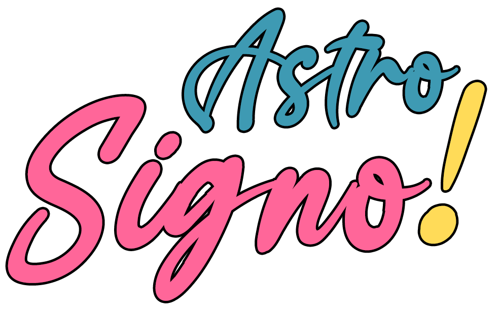

Esse é um projeto criado para a mentoria da Rafaela Givisiez, baseado no projeto do curso Começando do Zero da formação em **React Native** na Alura.

## 📱 Projeto

Este projeto está em construção, e no momento existe a tela  de horoscopo. Nesta tela é mostrado a lista dos signos.

## ‍💻 Técnicas e Tecnologias

As técnicas e tecnologias utilizadas no projeto são:

- `Expo`: tecnologia para simplificar o ambiente de desenvolvimento
- `Componentes React Native`: componentes já existentes básicos da tecnologia para compor a tela
  - `Text`: componente para exibir textos
  - `View`: container para blocos de componentes
  - `ScrollView`: container para blocos de componentes com barra de rolagem
  - `Image`: componente para exibir imagens
  - `TouchableOpacity`: componente para criar áreas clicáveis
- `Componentes customizados`: criação e utilização de componentes customizados
- `Suporte a telas`: não permitir que conteúdos estejam sob a *StatusBar* (barra superior nativa) ou barra de gestos do iPhone
- `Expo Google Fonts`: suporte a fontes do google via Expo
- `StyleSheet`: estilização básica de componentes
- `Dimensions`: captura de dados das dimenções da tela

